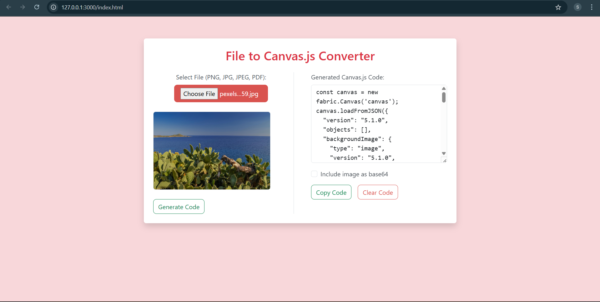

markdown
🎨 File to Canvas.js Converter

Convert PNG, JPEG, or PDF files into a `Canvas.js` (Fabric.js) object and view the generated code for easy use in your web projects.

🚀 Features

- 🖼 Upload image files (`.png`, `.jpg`, `.jpeg`) or PDF documents.
- 📄 Render files directly onto an HTML5 `<canvas>` using Fabric.js.
- 💻 Export Canvas state as Canvas.js code (JSON format).
- 🔗 Option to embed image as base64 or external URL.
- 📋 Copy or clear generated code easily from the UI.
- 🧼 Clean Bootstrap UI with responsive layout.

📂 File Structure

📁 file-to-canvasjs-converter/
│
├── index.html          # Main HTML structure
├── style.css           # Custom styles
├── app.js              # Core logic (Fabric.js, PDF.js)
└── README.md           # Project documentation

📸 Screenshot

🧰 Technologies Used

- HTML5, CSS3, JavaScript (ES6)
- [Bootstrap 5.3](https://getbootstrap.com/)
- [Fabric.js 5.3](http://fabricjs.com/)
- [PDF.js](https://mozilla.github.io/pdf.js/)

 
🔧 How It Works

1. **Upload File**: Choose any supported file type (`.png`, `.jpg`, `.jpeg`, `.pdf`).
2. **Preview Canvas**: The canvas displays the uploaded background image or first page of PDF.
3. **Generate Code**: Click **"Generate Code"** to view the `canvas.loadFromJSON()` object.
4. **Copy/Use Code**: Toggle base64 option or copy the code to reuse elsewhere.

 
📦 Setup

1. Clone or download this repository:

- git clone https://github.com/san-soni30/FileToCanvas.git

2. Open `index.html` in your browser.

3. Upload a file, generate Canvas.js code, and use it in your projects.

⚠️ Notes

* PDF rendering only shows the **first page**.
* Image background is scaled to fit the canvas.
* Use `Include Base64` checkbox to decide how image is embedded.

📁 Sample Use Case

const canvas = new fabric.Canvas('canvas');
canvas.loadFromJSON({...});

🙌 Contributions

Pull requests and improvements are welcome! If you'd like to add more file format support or features, feel free to fork this project.

📄 License

MIT License © 2025 Sanskruti Soni (https://github.com/san-soni30)

🎥 Demo
🌐 [Live Demo](https://san-soni30.github.io/FileToCanvas/)

Happy coding! 💻✨

Let me know if you'd like this tailored for GitHub Pages deployment or need a `preview.png` placeholder setup.